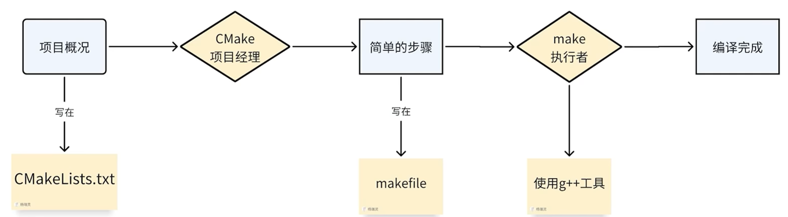

# CMake基本框架

## 一、CMake



```cmd
#没有CMakeLists就这样写
g++ src/cmake_learn.cpp tools/hello.cpp -I includes -o cmake_learn #编译
./cmake_learn #运行
```


### 1.CMakeLists.txt

```cmake
#前两行必写
cmake_minimum_required(VERSION 3.11)

project(CMake_test)

#添加xxx.hpp所在的文件夹（如果有多个，用空格隔开，要有完整路径）（如果是当前文件夹可以不用）
include_directories(./includes) # . 表示当前目录，在此情况下可以选择加也可以选择不加，因为默认会在project里面找

#获得某一目录下的所有源文件，定义为某一个变量
aux_source_directory(./tools TOOLS)

#手动添加需要的源文件，定义可执行文件（第一个是名称，后面是cpp文件，要有完整的路径）
add_executable(cmake_learn src/hello.cpp ${TOOLS})
```

```cmake
message(${TOOLS}) #最后终端输出各个文件的目录
message(TOOLS) #最后直接输出变量名TOOLS
```

```cmake
#链接库——加快编译的速度
cmake_minimum_required(VERSION 3.11)
project(ros_ws)
include_directories(./includes)

add_library(TOOLS STATIC tools/hello.cpp) #基本上不会改动的

#常用链接库        Linux  Windows（文件后缀）
#1.静态库 STATIC   # .a   .lib
#2.动态库 SHARED   # .so  .dll
#3.对象库 OBJECT   # .o   .obj

add_executable(cmake_learn src/cmake_learn.cpp) #会改动的文件
target_link_libraries(cmake_learn TOOLS) #链接cmake生成的文件和基本不会变的库
```


### 2.生成makefile并运行

```cmd
#在工作目录的终端里面输入
cmake -B build #查找所有的CMakeLists里面的文件，生成makefile
make -C build #在build文件夹里面生成可执行文件
build/ # + 可执行文件名
```

