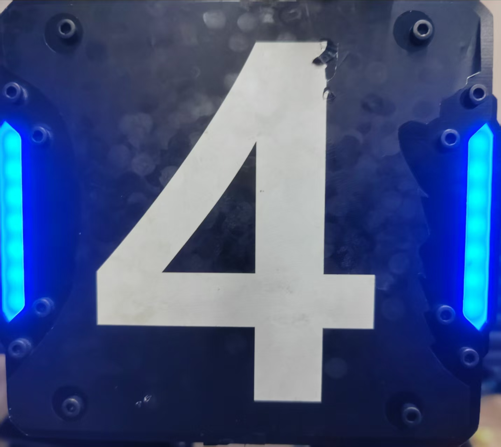
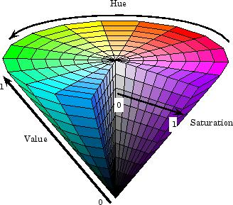
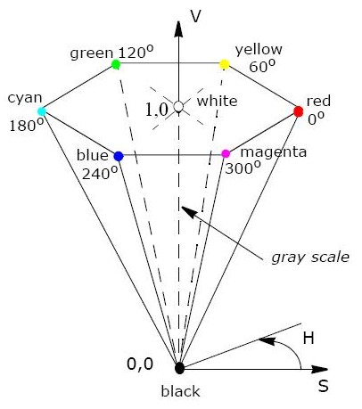

# RoboMaster视觉组第三次培训：装甲板的识别

## 目录

- [一、课程概述](#sec-overview)
- [二、本课会用到的 OpenCV 函数](#sec-opencv)
  - [1. 读图、缩放、显示](#sec-imread)
  - [2. 色彩空间与转换码](#sec-cvtcolor)
  - [3. 通道分离 `cv::split`](#sec-split)
  - [4. 轮廓 `cv::findContours` / `cv::drawContours`](#sec-contours)
  - [5. 旋转矩形 `cv::minAreaRect`](#sec-minarearect)
- [三、课堂演示](#sec-demo)
- [四、参考答案](#sec-answers)
- [五、和后续装甲板识别的衔接](#sec-next)

<a id="sec-overview"></a>
## 一、课程概述

对视觉组来说，自瞄、打前哨站、打基地，都建立在「先把装甲板从图像里找出来」之上。今天不直接上完整工程，先把本课会用到的 OpenCV 函数练熟。

## 

```
读图 imread
   │
   ├─ show_img：split 拆 B/G/R，看三个通道
   │
   └─ main：BGR → 灰度 → 二值 → 轮廓 → 旋转矩形
```

| 文件 | 作用 |
|------|------|
| `show_img.cpp` / `main.cpp` | 完整示例 |
| `show_img_hw.cpp` / `main_hw.cpp` | 课堂演示，按 Task 现场填写 |
| `include/img_tools.hpp` | 画点、画轮廓的小工具 |
| `imgs/red_3.jpg` | 默认输入图（红方装甲板） |

编译、运行必须在 `class_3/` 下，因为图片路径是相对路径：

```bash
cd class_3
cmake -B build
make -C build
build/show_img
build/main
```

安装 OpenCV：`sudo apt install libopencv-dev`。头文件统一写：

```cpp
#include <opencv2/opencv.hpp>
#include <vector>
#include "img_tools.hpp"   // 画轮廓 / 旋转矩形时才需要
```

---

<a id="sec-opencv"></a>
## 二、本课会用到的 OpenCV 函数

<a id="sec-imread"></a>
### 1. 读图、缩放、显示

```cpp
cv::Mat img = cv::imread("imgs/red_3.jpg");   // 读出来是 BGR
cv::resize(img, img, {}, 0.5, 0.5);           // 宽高都变成 0.5 倍；{} 表示不指定绝对尺寸
cv::imshow("gray", img);                      // 窗口名自己起
cv::waitKey(0);                               // 等到按任意键再结束
```

演示里先缩小再 `imshow`、再 `resize(..., 2, 2)` 放大回去，只是为了窗口别太大，后面的二值化和找轮廓仍用原尺寸。

<a id="sec-cvtcolor"></a>
### 2. 色彩空间与转换码

OpenCV 默认通道顺序是 **BGR**，不是 RGB。`channels.at(0)` 是蓝，`at(2)` 是红。

| 空间 | 通道 | 本课用途 |
|------|------|----------|
| **BGR** | B、G、R | `imread` 读出来就是它 |
| **Gray** | 单通道亮度 | 二值化、找轮廓的前置步骤 |
| **Binary** | 0 / 255 | `findContours` 的输入 |
| **HSV** | H（色相）、S（饱和度）、V（明度） | 按颜色分割（后续识别红/蓝会用） |

颜色转换：

```cpp
cv::cvtColor(src, dst, code);   // src：输入图；dst：输出图
```

OpenCV 里很多函数都这样写：`src` 是原来的图（source），`dst` 是处理完得到的新图（destination）。写代码时换成自己的变量名即可，例如 `cvtColor(bgr_img, gray_img, ...)`。

| 转换码 | 含义 |
|--------|------|
| `cv::COLOR_BGR2GRAY` | 彩色 → 灰度 |
| `cv::COLOR_BGR2HSV` | 彩色 → HSV |
| `cv::COLOR_BGR2RGB` | BGR → RGB（一般显示才用） |

灰度再变成二值：

```cpp
cv::threshold(src, dst, thresh, maxval, type);   // src：灰度图；dst：二值图
```

| 参数 | 本课取值 | 含义 |
|------|----------|------|
| `thresh` | `120` | 阈值 |
| `maxval` | `255` | 超过阈值时写成这个值 |
| `type` | `cv::THRESH_BINARY` | ≥ 阈值 → `maxval`，否则 → 0 |

合在一起：

```cpp
cv::cvtColor(bgr, gray, cv::COLOR_BGR2GRAY);
cv::threshold(gray, binary, 120, 255, cv::THRESH_BINARY);
```

后续按颜色抠灯条时会用到 HSV：

```cpp
cv::cvtColor(bgr, hsv, cv::COLOR_BGR2HSV);
cv::inRange(hsv, cv::Scalar(100, 80, 80), cv::Scalar(124, 255, 255), mask);
```

`inRange` 的意思是：像素的 H、S、V 都落在上下限之间，就写成 255（白），否则写成 0（黑），结果放进 `mask`。

| 参数 | 本课取值 | 含义 |
|------|----------|------|
| 第 1 个 | `hsv` | 输入图（HSV） |
| 第 2 个 | `Scalar(100, 80, 80)` | 下限：H≥100，S≥80，V≥80 |
| 第 3 个 | `Scalar(124, 255, 255)` | 上限：H≤124，S≤255，V≤255 |
| 第 4 个 | `mask` | 输出的黑白掩码图 |

OpenCV 里 H 的范围是 **0～180**（不是 0～360）。上面这组大约是蓝色；红色会绕过 0 和 180，通常要写两段再拼起来。

###                

<a id="sec-split"></a>
### 3. 通道分离 `cv::split`

```cpp
std::vector<cv::Mat> channels;
cv::split(bgr_img, channels);     // 拆成 3 张单通道图
cv::Mat blue  = channels.at(0);   // B
cv::Mat green = channels.at(1);   // G
cv::Mat red   = channels.at(2);   // R
```

红方灯条在 **R 通道**往往更亮，蓝方则在 **B 通道**更亮。

<a id="sec-contours"></a>
### 4. 轮廓 `cv::findContours` / `cv::drawContours`

```cpp
cv::findContours(image, contours, mode, method);
```

| 参数 | 本课取值 | 含义 |
|------|----------|------|
| `image` | 二值图 `binary_img` | 白区域会被描边 |
| `contours` | `std::vector<std::vector<cv::Point>>` | 外层：有几条轮廓；内层：这条轮廓上的点 |
| `mode` | `cv::RETR_EXTERNAL` | 只取最外层轮廓 |
| `method` | `cv::CHAIN_APPROX_NONE` | 保留边界上每一个点 |

画轮廓：

```cpp
cv::drawContours(image, contours, contourIdx, color, thickness);
```

| 参数 | 本课取值 | 含义 |
|------|----------|------|
| `contourIdx` | `{}` 或 `-1` | 画全部轮廓 |
| `color` | `{0, 0, 255}` | BGR 颜色，亮红 |
| `thickness` | `5` | 线宽 |

本课 `tools::drawContour` 会把轮廓上每个点画出来，方便看 `findContours` 到底找到了什么。

<a id="sec-minarearect"></a>
### 5. 旋转矩形 `cv::minAreaRect`

```cpp
cv::RotatedRect rr = cv::minAreaRect(contour);   // 用面积最小的旋转矩形包住轮廓
std::vector<cv::Point2f> points(4);
rr.points(points.data());                        // 取出 4 个角点
```

轮廓数量事先不知道，用 `std::vector` 存：

```cpp
std::vector<cv::RotatedRect> rotated_rects;
rotated_rects.emplace_back(rotated_rect);   // 往末尾追加
```

画矩形四个角用 `tools::draw_points`。在副本上画图时先 `clone()`，避免把原图涂花：

```cpp
cv::Mat drawcontours = bgr_img.clone();
```

---

<a id="sec-demo"></a>
## 三、课堂演示

对照 `show_img.cpp` / `main.cpp`，在 `*_hw.cpp` 里按 Task 把语句填上。

```bash
make -C build show_img_hw main_hw
build/show_img_hw    # 应弹出 blue / green / red
build/main_hw        # 应弹出 gray / binary / drawcontours / drawrect
```

`show_img_hw.cpp` 要写：`imread`、`split`、取 B/G/R、`resize`、`imshow`。

`main_hw.cpp` 要写：

| Task | 函数 | 窗口 |
|------|------|------|
| 1 | `cvtColor`，转换码 `COLOR_BGR2GRAY` | `gray` |
| 2 | `threshold`，`120 / 255 / THRESH_BINARY` | `binary` |
| 3 | `findContours`，`RETR_EXTERNAL` + `CHAIN_APPROX_NONE` | （不弹窗） |
| 4 | `drawContours`，颜色 `{0, 0, 255}`，线宽 5 | `drawcontours` |
| 5 | `minAreaRect` + `emplace_back` | （不弹窗） |
| 6 | `rotated_rect.points(...)` | `drawrect` |

灰度、二值显示完后记得 `resize(..., 2, 2)` 恢复原大小，否则后面找轮廓会和原图对不上。

> 把路径改成 `imgs/blue_4.jpg`，看 blue / red 谁更亮。把阈值 `120` 改成 `80` 和 `200`，看 `binary` 和轮廓数量怎么变。

---

<a id="sec-answers"></a>
## 四、参考答案

`show_img_hw.cpp`：

```cpp
bgr_img = cv::imread("imgs/red_3.jpg");
cv::split(bgr_img, channels);
blue = channels.at(0);
green = channels.at(1);
red = channels.at(2);
cv::resize(blue, blue, {}, 0.5, 0.5);
cv::resize(green, green, {}, 0.5, 0.5);
cv::resize(red, red, {}, 0.5, 0.5);
cv::imshow("blue", blue);
cv::imshow("green", green);
cv::imshow("red", red);
```

`main_hw.cpp`：

```cpp
cv::cvtColor(bgr_img, gray_img, cv::COLOR_BGR2GRAY);
cv::resize(gray_img, gray_img, {}, 0.5, 0.5);
cv::imshow("gray", gray_img);
cv::resize(gray_img, gray_img, {}, 2, 2);

cv::threshold(gray_img, binary_img, 120, 255, cv::THRESH_BINARY);
cv::resize(binary_img, binary_img, {}, 0.5, 0.5);
cv::imshow("binary", binary_img);
cv::resize(binary_img, binary_img, {}, 2, 2);

cv::findContours(binary_img, contours, cv::RETR_EXTERNAL, cv::CHAIN_APPROX_NONE);
cv::drawContours(drawcontours, contours, {}, {0, 0, 255}, 5);
cv::resize(drawcontours, drawcontours, {}, 0.5, 0.5);
cv::imshow("drawcontours", drawcontours);

auto rotated_rect = cv::minAreaRect(contour);
rotated_rects.emplace_back(rotated_rect);
rotated_rect.points(points.data());
cv::resize(drawrect, drawrect, {}, 0.5, 0.5);
cv::imshow("drawrect", drawrect);
```

---

<a id="sec-next"></a>
## 五、和后续装甲板识别的衔接

| 本课算子 | 后面怎么用 |
|----------|------------|
| `split` / BGR | 比较轮廓上蓝、红通道，判断敌我颜色 |
| `cvtColor` BGR→Gray | 灯条检测前先转灰度 |
| `threshold` | 把亮灯条变成白色连通域 |
| `findContours` | 抠出灯条轮廓 |
| `minAreaRect` | 拟合灯条，再算长宽比、角度 |

完整自瞄还会做几何过滤、灯条配对、数字分类等，留给后续课程。今天先保证：通道能拆开，灰度 → 二值 → 轮廓 → 旋转矩形能跑通。
